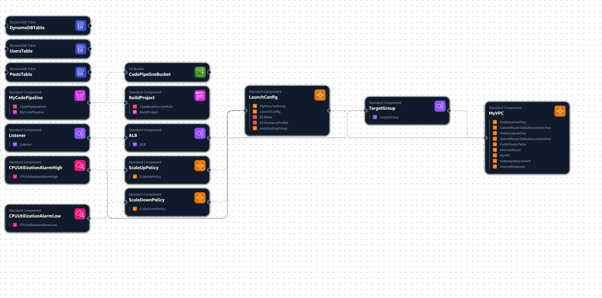
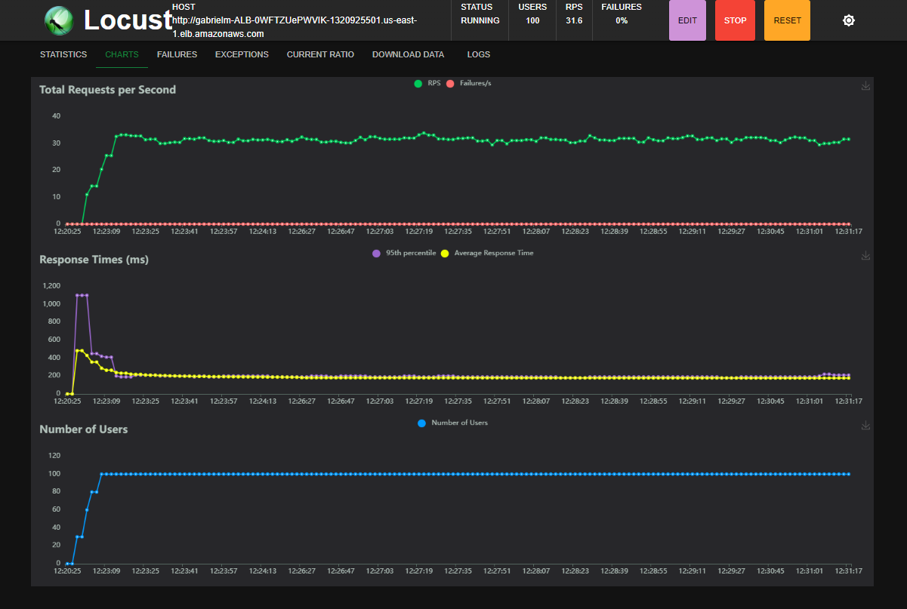
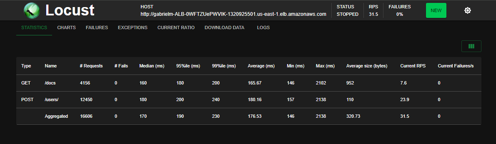

<div style="text-align: center;">
  <h1>
    Implementação de Arquitetura Cloud com FastAPI e AWS
  </h1>
</div>


## Autor

**Nome:** Gabriel Mendonça de Mello Hermida 

**Curso:** Engenharia da Computação  

**Semestre:** 6º 

**Contato:** gabrielmmh@al.insper.edu.br  

**Ano:** 2024 

**Repositório:** https://github.com/gabrielmmh/proj_cloud

# Descrição do Projeto
Este projeto tem como objetivo provisionar uma infraestrutura na AWS utilizando o CloudFormation, que engloba o uso de um Application Load Balancer (ALB), instâncias EC2 com Auto Scaling, e um banco de dados DynamoDb. Para mostrar a integração das instâncias com o banco de dados, foi desenvolvida uma aplicação web com FastAPI que realiza operações CRUD de usuários e posts. Além disso, a infraestrutura possui um script de testes de carga com Locust, que simula a interação de múltiplos usuários com a aplicação, o que permite avaliar a escalabilidade da infraestrutura e testar o funcionamento do Auto Scaling. Por fim, a infraestrutura é gerenciada por um pipeline de CI/CD com CodePipeline e CodeBuild, que monitora um repositório no GitHub e realiza o deploy automático da aplicação, e faz uso do Secrets Manager para armazenar as credenciais do GitHub do projeto de forma segura.

### Pré-requisitos

Para executar o projeto, é necessário:

- Uma conta AWS com permissões apropriadas

- Uma conta no GitHub 

- AWS CLI instalado

- Git instalado


# Documentação e Decisões Técnicas

* ## Região AWS

  A região escolhida foi `us-east-1 (N. Virginia)` devido ao custo e latência mais baixos.

* ## Breve descrição dos Componentes da Infraestrutura

  ### VPC (Virtual Private Cloud)

  A **VPC** é a rede virtual na AWS onde todos os recursos são provisionados. Nesta configuração, temos:

  - **MyVPC**: A VPC principal com suporte a DNS e hostnames habilitado.

  - **PublicSubnets**: Duas subnets públicas, cada uma em uma zona de disponibilidade diferente, garantindo alta disponibilidade.

  - **InternetGateway**: Um gateway que permite que as instâncias na VPC acessem a internet.

  - **RouteTables**: Tabelas de roteamento para gerenciar o tráfego dentro da VPC.

  - **SecurityGroups**: Grupos de segurança que controlam o tráfego de entrada e saída para as instâncias e para o ALB.

  ### Application Load Balancer (ALB)

  O **ALB** distribui o tráfego entre as instâncias EC2:

  - **ALB**: Balanceador de carga que distribui o tráfego HTTP.

  - **TargetGroup**: Grupo de destino que gerencia as instâncias EC2 associadas ao ALB.

  - **Listener**: Listener do ALB que roteia o tráfego HTTP para o TargetGroup.

  ### Auto Scaling Group (ASG)

  O **ASG** gerencia a escalabilidade das instâncias EC2:

  - **AutoScalingGroup**: Grupo que ajusta automaticamente o número de instâncias EC2 em resposta à demanda.

  - **LaunchConfig**: Configuração de lançamento que define a AMI, tipo de instância, e outras configurações de rede.

  - **Scaling Policies**: Políticas que escalam as instâncias com base em métricas do CloudWatch, como a utilização da CPU.

  ### DynamoDB

  O **DynamoDB** é um banco de dados NoSQL utilizado para armazenar dados:

  - **UsersTable**: Tabela que armazena informações dos usuários.

  - **PostsTable**: Tabela que armazena os posts, com um índice secundário global para consultas rápidas por `user_id`.

  ### IAM (Identity and Access Management)

  O **IAM** gerencia as permissões de acesso:

  - **IAM Roles**: Funções que concedem permissões às instâncias EC2 e ao CodePipeline.

  - **InstanceProfile**: Perfil de instância que associa a função IAM às instâncias EC2.

  ### CodePipeline

  O **CodePipeline** automatiza o deploy da infraestrutura:

  - **Pipeline**: Pipeline CI/CD que automatiza o processo de deploy.

  - **CodeBuild Project**: Projeto CodeBuild que compila e implanta o código.

  - **S3 Bucket**: Bucket S3 que armazena os artefatos do pipeline.

  ### CloudWatch

  O **CloudWatch** monitora a infraestrutura:

  - **Alarms**: Alarmes que monitoram a utilização da CPU e outras métricas para ativar políticas de escalabilidade.

  ### Secrets Manager

  O **Secrets Manager** armazena as credenciais do GitHub de forma segura:

  - **GitHubSecret**: Segredo que armazena o nome de usuário e token de acesso do GitHub.

  <h3>
    <details>
      <summary>Diagrama da Arquitetura</summary>
      <div style="text-align: center;">
      
      </div>
    </details>
  </h3>


# CodePipeline CI/CD

A infraestrutura deste projeto é gerenciada e implantada automaticamente usando o AWS CodePipeline, um serviço de integração contínua e entrega contínua (CI/CD). O CodePipeline automatiza o processo de compilação, teste e implantação do código a cada mudança, garantindo que a infraestrutura esteja sempre atualizada e funcionando conforme o esperado. Aqui está uma visão geral de como o CodePipeline funciona neste projeto:

### Configuração Inicial

  * **Configuração do Repositório GitHub**: 

      O código-fonte da infraestrutura e da aplicação é armazenado em repositórios GitHub. O script `deploy.sh` inicializa esses repositórios e configura o GitHub para integração com o CodePipeline.

  * **Pipeline de Código**: 

      O `codepipeline.yaml` define a configuração do pipeline, incluindo as etapas de origem, compilação e implantação. O pipeline é configurado para ser acionado automaticamente a cada commit no repositório GitHub.

### Etapas do Pipeline

  * **Fonte**: 

      A primeira etapa do pipeline extrai o código-fonte do repositório GitHub. A configuração do GitHub é feita usando as credenciais armazenadas no AWS Secrets Manager.

  * **Compilação**: 

      A etapa de compilação utiliza o AWS CodeBuild para executar o script de compilação definido na aba de BuildSpec. Este script executa o CloudFormation para implantar ou atualizar a infraestrutura descrita nos templates YAML.

  * **Implantação**: 

      Na etapa de implantação, o CloudFormation aplica as mudanças na infraestrutura, criando ou atualizando os recursos conforme necessário. A configuração inclui a criação de uma VPC, sub-redes, grupos de segurança, balanceador de carga (ALB), grupos de autoescalonamento (ASG), instâncias EC2, tabelas DynamoDB e outros recursos AWS.

### Atualizações Contínuas

Cada vez que uma mudança é feita no repositório GitHub e um commit é realizado, o CodePipeline é acionado automaticamente. Isso garante que qualquer mudança na configuração da infraestrutura ou no código da aplicação seja automaticamente implantada, mantendo a consistência e a confiabilidade do ambiente de produção.

# Análise de Carga

Os testes de carga são essenciais para avaliar a escalabilidade e o desempenho da infraestrutura. Neste projeto, os testes de carga são realizados com o `Locust`, uma ferramenta de teste de carga e estresse que permite simular o comportamento de múltiplos usuários interagindo com a aplicação. O script `locustfile.py` define os comportamentos dos usuários, incluindo a visualização da página principal e a criação de novos usuários.

Após a execução do teste, os resultados são exibidos em uma interface gráfica, onde é possível analisar o desempenho da aplicação sob carga. Abaixo está a imagem dos resultados de um teste de carga que foi realizado com 100 usuários virtuais, com requisições de intervalos aleatórios entre 1 e 5 segundos, 10 de ramp-up e cerca de 10 minutos de duração.

<div style="text-align: center;">
    <h3> Aba Charts do Locust </h3>
    
</div>

<div style="text-align: center; margin-bottom: 50px;">
    <h3> Aba Statistics do Locust </h3>
    
</div>

# Estimativas de Custos


Para calcular os custos da arquitetura, foi utilizado o [AWS Pricing Calculator](https://calculator.aws/#/). O AWS Pricing Calculator é uma ferramenta que permite criar estimativas de custos para seus projetos na AWS. Com base na configuração da infraestrutura, foram estimados os custos iniciais e mensais, bem como o custo total de 12 meses, a estimativa completa pode ser vista no arquivo [Estimativa de Custos](assets/MyEstimate.pdf).

### Resumo da Estimativa

- **Custo inicial**: 180,00 USD

- **Custo mensal**: 63,29 USD

- **Custo total de 12 meses**: 939,48 USD (inclui o custo inicial)

### Estimativa Detalhada

| Nome                | Grupo Aplicado   | Região               | Custo inicial | Custo mensal | Resumo da configuração |
|---------------------|------------------|----------------------|---------------|--------------|------------------------|
| Amazon CloudWatch   | Nenhum           | US East (N. Virginia)| 0,00 USD      | 0,60 USD     | Número de métricas (inclui métricas detalhadas e personalizadas) (2) |
| Amazon Virtual Private Cloud (VPC) | Nenhum           | US East (N. Virginia)| 0,00 USD      | 1,52 USD     | Dias úteis por mês (22), Número de conexões do Site-to-Site VPN (1) |
| Elastic Load Balancing | Nenhum        | US East (N. Virginia)| 0,00 USD      | 19,35 USD    | Número de Application Load Balancers (1) |
| AWS CodeBuild       | Nenhum           | US East (N. Virginia)| 0,00 USD      | 2,25 USD     | Tipo de computação do Amazon CodeBuild (EC2 sob demanda), Número de compilações em um mês (10), Sistema operacional (Linux), Tipo de instância de computação (arm1.large), Número de compilações em um mês (1), Número de instâncias (1) |
| AWS CodePipeline    | Nenhum           | US East (N. Virginia)| 0,00 USD      | 9,00 USD     | Número de pipelines ativos usados por conta, por mês (10) |
| Amazon EC2          | Nenhum           | US East (N. Virginia)| 0,00 USD      | 3,94 USD     | Locação (Instâncias compartilhadas), Sistema operacional (Linux), Carga de trabalho (Consistent, Número de instâncias: 3), Instância do EC2 avançada (t4g.nano), Pricing strategy (3yr No Upfront), Habilitar monitoramento (desabilitada), DT Entrada: Not selected (0 TB por mês), DT Saída: Not selected (0 TB por mês), DT Intrarregião: (0 TB por mês) |
| Amazon DynamoDB     | Nenhum           | US East (N. Virginia)| 180,00 USD    | 26,39 USD    | Classe de tabela (Standard), Tamanho médio do item (todos os atributos) (50 Byte), Prazo da capacidade reservada de gravação (1 ano), Prazo da capacidade reservada de leitura (1 ano), Tamanho do armazenamento de dados (1 GB) |
| Amazon Simple Storage Service (S3) | Nenhum           | US East (N. Virginia)| 0,00 USD      | 0,24 USD     | Armazenamento S3 Standard (10 GB por mês), Dados retornados pelo S3 Select (10 GB por mês) |

### Análise dos Principais Gastos

Os principais custos mensais são provenientes dos seguintes serviços:

1. **Elastic Load Balancing**: 19,35 USD/mês - Responsável pela distribuição de tráfego entre as instâncias EC2.

2. **Amazon DynamoDB**: 26,39 USD/mês - Custo devido à capacidade reservada de leitura e gravação e armazenamento de dados.

3. **AWS CodePipeline**: 9,00 USD/mês - Custos com pipelines ativos.

4. **Amazon EC2**: 3,94 USD/mês - Custo com instâncias t4g.nano para execução da aplicação.

### Possíveis Otimizações

Para reduzir os custos, algumas otimizações podem ser consideradas:

1. **Elastic Load Balancing**:

   - **Uso de ALB**: Verificar se é necessário manter o ALB ativo continuamente. Se a aplicação não requer alta disponibilidade constante, o ALB pode ser desligado durante períodos de baixa utilização.

   - **Revisar Necessidade de ALB**: Dependendo do tráfego da aplicação, pode-se considerar alternativas mais econômicas ou ajustar as configurações do ALB para economizar custos.

2. **Amazon DynamoDB**:

   - **Revisão da Capacidade Reservada**: Ajustar a capacidade reservada de leitura e gravação conforme a necessidade real da aplicação.

   - **Compactação de Dados**: Otimizar o tamanho dos itens armazenados para reduzir o custo com armazenamento.

3. **AWS CodePipeline**:

   - **Revisar Número de Pipelines**: Reduzir o número de pipelines ativos se possível, ou consolidar pipelines para economizar custos.

4. **Amazon EC2**:

   - **Tipos de Instância**: Revisar se os tipos de instância utilizados são os mais econômicos para a carga de trabalho. Considerar instâncias spot ou reserved instances para obter descontos.

   - **Dimensionamento**: Ajustar o número de instâncias conforme a demanda real da aplicação para evitar custos desnecessários.

Estas otimizações podem ajudar a reduzir os custos operacionais sem comprometer o desempenho e a disponibilidade da aplicação.

### Custos Reais

A estimativa de custos é baseada em preços padrão e pode variar dependendo do uso real da infraestrutura. Monitorando os custos reais na [AWS Billing Console](https://aws.amazon.com/billing/) foi possível observar que o custo mensal previsto foi de 66,09 USD, o que está próximo da estimativa inicial. 

# Instruções de Uso

### Configuração das Credenciais AWS

1. **Criar Usuário IAM no Console AWS**:

   - Acesse o [Console de Gerenciamento da AWS](https://aws.amazon.com/console/).

   - Navegue para **IAM** (Identity and Access Management) e selecione **Users**.

   - Clique em **Add user** e forneça um nome de usuário.

   - Selecione **Programmatic access** para habilitar o acesso via API/CLI.

   - Clique em **Next: Permissions**.

2. **Atribuir Políticas ao Usuário**:

   - **Gerenciadas pela AWS**:

     - `AdministratorAccess`

     - `AmazonDynamoDBFullAccess`

     - `AmazonEC2FullAccess`

     - `AmazonS3FullAccess`

     - `AWSCloudFormationFullAccess`

     - `AWSCodeBuildAdminAccess`

     - `AWSCodeDeployFullAccess`

     - `AWSCodePipeline_FullAccess`

     - `IAMFullAccess`

     - `SecretsManagerReadWrite`

   - **Política Customizada** (`MyPolicies`):
     ```json
     {
       "Version": "2012-10-17",
       "Statement": [
         {
           "Effect": "Allow",
           "Action": [
             "cloudformation:*",
             "iam:*",
             "iam:DeleteRolePolicy",
             "dynamodb:*",
             "ec2:*",
             "secretsmanager:*",
             "sts:AssumeRole",
             "codepipeline:*",
             "codebuild:*",
             "codecommit:*",
             "codedeploy:*"
           ],
           "Resource": "*"
         }
       ]
     }
     ```

3. **Obter Credenciais de Acesso**:

   - Após a criação do usuário, entre na aba de **Security credentials** e crie uma chave de acesso para CLI e salve a chave de acesso e a chave de acesso secreta.

4. **Configurar AWS CLI**:

   - No terminal, execute o comando `aws configure` e forneça as credenciais obtidas:
   
     ```sh
     aws configure
     ```

### Configuração das Credenciais GitHub

1. **Acessar sua Conta GitHub**:

   - Acesse o [GitHub](https://github.com/) e faça login na sua conta.

2. **Gerar Token de Acesso**:

   - Navegue para **Settings** > **Developer settings** > **Personal access tokens**.

   - Clique em **Generate new token** e forneça um nome e as permissões necessárias:

     - `repo` (Full control of private repositories)

     - `user` (Update All User Data)

     - `delete_repo` (Delete repositories)

   - Clique em **Generate token** e guarde o token gerado.

### Preparação do Ambiente

* **Clone o repositório (pule este passo se já tiver clonado)**:

    ```sh
    git clone https://github.com/gabrielmmh/proj_cloud
    ```
* **Acesse o diretório do projeto**:

    ```sh
    cd proj_cloud
    ```

### Deploy da Infraestrutura

* **Configure as credenciais GitHub**:

    Faça o script `deploy.sh` ser executável:

    ```sh
    chmod +x deploy.sh
    ```

    Execute o script `deploy.sh` e siga as instruções para configurar suas credenciais GitHub.

    ```sh
    ./deploy.sh
    ```

* **Espere até que o CloudFormation complete a criação da stack**.

### Teste da Aplicação

* **Acesse a URL do ALB**:

    - Após a criação da stack, acesse a URL gerada para o ALB no terminal.

* **Teste a Aplicação**:
  
    - Realize operações CRUD na aplicação e verifique se os dados são armazenados corretamente no DynamoDB. Para verificar, você pode fazer requisições na aba GET do Swagger.

### Testes de Carga com Locust

* **Execute o script dos testes de carga**:   

    ```sh
    chmod +x locust.sh
    ./locust.sh
    ```

* **Acesse a interface do [Locust](http://localhost:8089) e configure o número de usuários e a taxa de requisições.**

    - Para realizar o mesmo teste do exemplo, utilize 100 usuários, 10 de ramp-up e 10 minutos de duração.

* **Acompanhe os resultados dos testes na interface do Locust.**

    - Você pode navegar pelas abas de `Statistics`, `Charts` e `Failures` para analisar o desempenho da aplicação.

* **Após os testes, pressione `Ctrl+C` no terminal para encerrar o Locust.**

### Teste da CodePipeline

* **Configuração do Repositório**

Durante o deploy, o script clona o repositório `proj_infra_cloud` na mesma altura do `proj_cloud`, facilitando o teste de usabilidade da CodePipeline.

* **Passos para Testar a Atualização da Stack**

  1. **Abra o repositório `proj_infra_cloud` no VSCode**:
      ```sh
      code ../proj_infra_cloud
      ```

  2. **Descomente os alarmes no arquivo `vpc.yaml`**:

      - Descomente as linhas 278 a 293 e 234 a 249, que configuram os alarmes `HTTP5xxAlarmHigh` e `HTTP5xxAlarmLow`.

  3. **Faça um commit das alterações e envie para o repositório**:

      ```sh
      git add .
      git commit -m "Descomentando alarmes para teste"
      git push
      ```

  4. **Verifique a atualização da stack no AWS Console**:
      - Acesse o AWS Console e verifique a atualização da stack no CloudFormation.

### Desligamento da Infraestrutura

* **Para derrubar a infraestrutura, execute o script `shutdown.sh`**:

    ```sh
    chmod +x shutdown.sh
    ./shutdown.sh
    ```

## Referências

- [AWS Documentation](https://docs.aws.amazon.com/)

- [FastAPI Documentation](https://fastapi.tiangolo.com/)

- [GitHub Documentation](https://docs.github.com/)

- [Locust Documentation](https://locust.io/)
